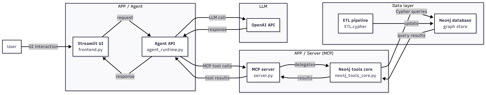
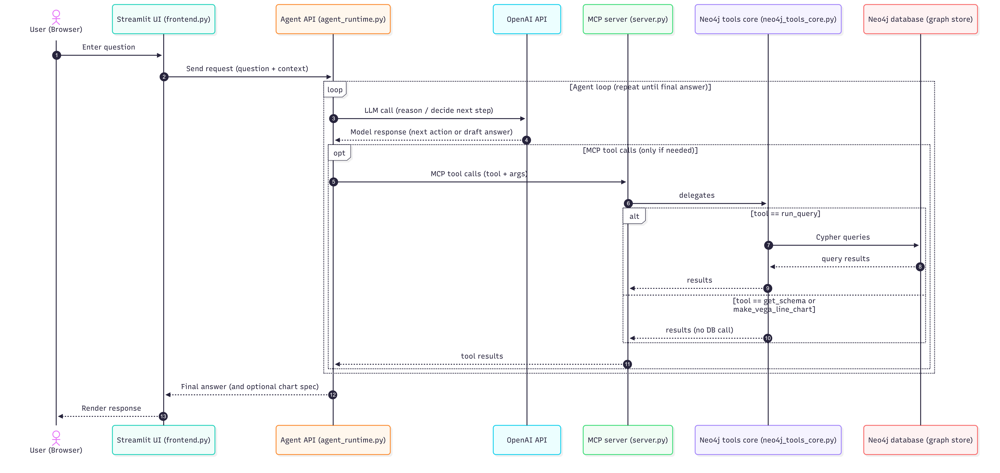

# Neo4j + MCP + Agent (Streamlit)

## About the Project
This project implements a chatbot for exploring public transport network data modeled as a graph in Neo4j. Users ask questions in natural language, and an LLM-driven agent generates the required queries and calls an MCP server that exposes predefined Neo4j tools. These tools execute Cypher queries against the database and return structured results, which the agent then explains in a readable way. In short, the system bridges a powerful graph model and a user-friendly conversational interface, making network- and time-aware analysis accessible to non-technical users.

## Repository structure
- `APP/Agent` : Streamlit UI and agent runtime  
- `APP/Server` : MCP server + Neo4j tools core  
- `Neo4j` : Neo4j (Docker) + ETL Cypher scripts to load/update the graph  
- `Benchmarking` : datasets for evaluation  

## System design


## Request flow


## Setup / Quickstart (local)

### 1) Create and activate a virtual environment
```bash
python -m venv .venv
source .venv/bin/activate   # Windows: .venv\Scripts\activate
```

### 2) Install dependencies
```bash
pip install -r requirements.txt
```

### 3) Configure environment variables
Create a local `.env` file from the template and fill in your values:
```bash
cp .env.example .env
```

### 4) Neo4j (Docker) + ETL (load CSVs into the knowledge graph)

#### 4.1 Download the CSV data (one city code)
Download the three datasets from Zenodo (record `15839004`) and pick the **same city code** in each archive (e.g., `GM0047`):
- `travel_times.zip` → `GM0047.csv`
- `dwell_times.zip` → `GM0047.csv`
- `trajectories.zip` → `GM0047.csv`

#### 4.2 Prepare folders and place the CSVs
From the repository root:

```bash
cd Neo4j
mkdir -p data logs plugins import/travel_times import/dwell_times import/trajectories
```

Rename/copy the three CSVs into these locations (example for `GM0059`):

- `Neo4j/import/travel_times/travel_time_GM0059.csv`
- `Neo4j/import/dwell_times/dwell_time_GM0059.csv`
- `Neo4j/import/trajectories/trajectories_GM0059.csv`

Make sure the file names match the pattern used by the ETL:
- `travel_time_<CITY>.csv`
- `dwell_time_<CITY>.csv`
- `trajectories_<CITY>.csv`

#### 4.3 Start Neo4j
```bash
docker compose up -d
```

#### 4.4 Run ETL (load the data into Neo4j)
```bash
docker exec neo4j cypher-shell -u neo4j -p password -d neo4j -f /var/lib/neo4j/import/ETL.cypher
```

#### 4.5 Quick tests
```bash
docker exec neo4j cypher-shell -u neo4j -p password -d neo4j "MATCH (s:Stop) RETURN count(s) AS stops;"
docker exec neo4j cypher-shell -u neo4j -p password -d neo4j "MATCH (r:Route) RETURN count(r) AS routes;"
```

### 5) Run the MCP server
In one terminal:
```bash
cd APP/Server
python server.py
```

### 6) Run the Streamlit UI
In a second terminal:
```bash
cd APP/Agent
streamlit run frontend.py
```

Open the Streamlit URL shown in the terminal output.
